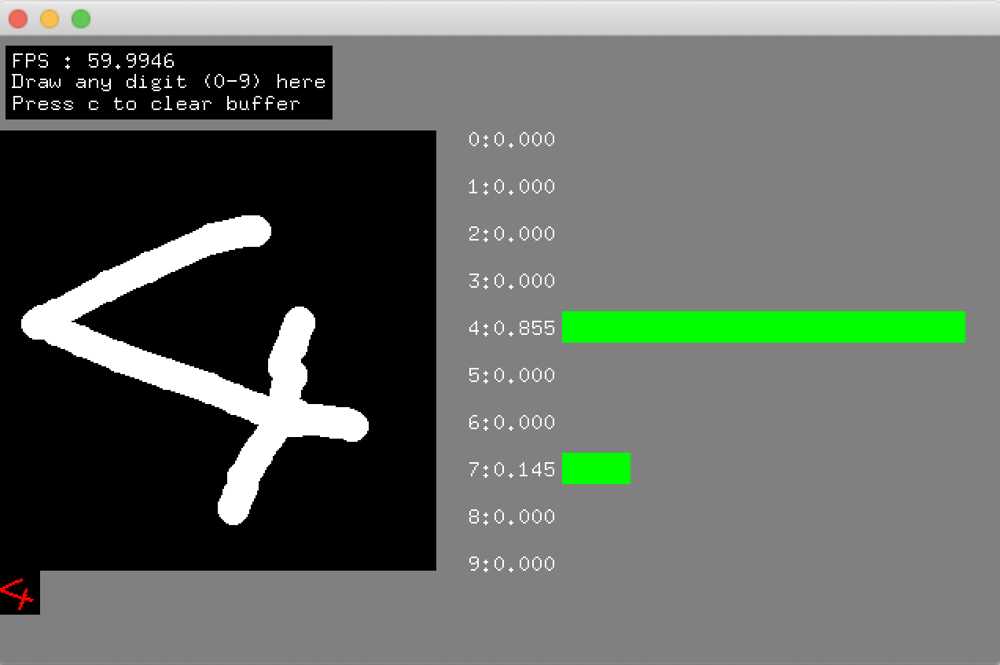

# ofxOnnxRuntime
[ONNX Runtime](https://github.com/microsoft/onnxruntime) tiny wrapper for openFrameworks

## Installation
- macOS
    - copy `libonnxruntime.1.10.0.dylib` to `/usr/local/lib` 
    - Generate a project using ProjectGenerator.
- Windows
    - There are two ways to install ONNX Runtime on your project.
    1. Install using NuGet
        - I recommend this way in general.
        - Generate a project using ProjectGenerator.
        - Open `sln` file.
        - Right click your project on `Solution Explorer` pane, and then select `Manage NuGet Packages...`.
        - From `Browse` tab, search `Microsoft.ML.OnnxRuntime` (CPU) or `Microsoft.ML.OnnxRuntime.Gpu` (GPU) and install it.
    2. DLL direct download
        - You can download prebuilt DLLs from [here](https://github.com/microsoft/onnxruntime/releases).
        - Unzip downloaded `onnxruntime-win-x64-(gpu-)1.10.0.zip` and locate files on `libs\onnxruntime\lib\vs\x64\` .
        - Generate a project using ProjectGenerator, then all libs are linked correctly and all dlls are copied to `bin`.

## Tested environment
- oF 0.11.2 + MacBookPro 2018 Intel + macOS Catalina
- oF 0.11.2 + VS2017 + Windows 10 + RTX2080Ti + CUDA 11.4

## ToDo
- check M1 Mac (should work), Linux CPU&GPU

## Reference Implementation
- I heavily referred [Lite.AI.ToolKit](https://github.com/DefTruth/lite.ai.toolkit) implementation.
